# Card Concept UI Direction

Date: 2026-05-19  
Branch: `collab/card-repository-ui`

This directory records the new interface concept for HPS Reader: a restrained scholarly productivity tool that borrows card-game interaction logic without becoming a colorful game UI.

## Design Thesis

HPS Reader should feel like a young scholar's private research card system, not a generic PDF reader and not a bright game lobby.

The card concept is expressed through structure and interaction:

- Documents become archive cards.
- Pages become active cards.
- Translations become companion cards.
- Agent actions become command cards.
- Optional modules become equipped cards.
- OCR issues become inspection and repair cards.
- Notes become filed thought cards.
- Glossary terms become a terminology deck.
- Export becomes assembling a deliverable bundle.
- Collaboration becomes assignment cards.
- Revision history becomes save slot cards.

## Visual Balance

The target balance is:

```text
90% quiet production surface
10% sparse state accents
```

Use:

- Warm off-white backgrounds.
- Graphite text.
- Soft gray panels.
- Thin borders.
- Subtle paper texture.
- Low-saturation blue-gray, ochre, and green only for state.

Avoid:

- Rainbow palettes.
- Neon game effects.
- Fantasy card art.
- Mascots or characters.
- Corporate dashboard density.
- Permanent heavy sidebars.

## Concept Screens

### 1. Overview / Private Card Repository

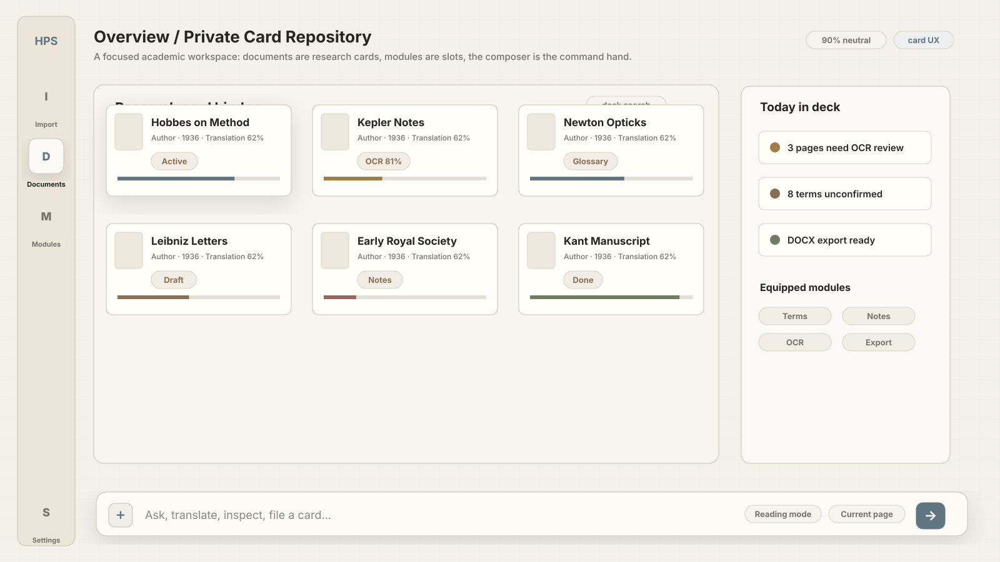

The home state presents the product as a private research card binder. The composer is always present as the command entry.

### 2. Import / Add Materials To Deck

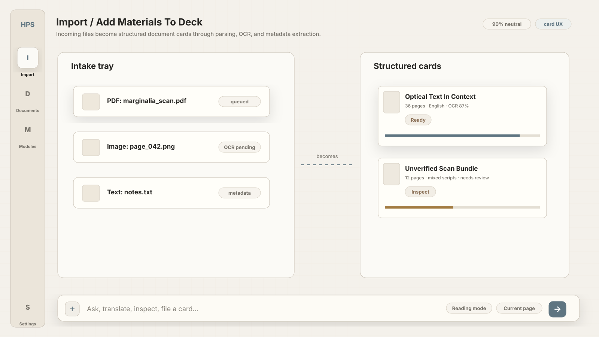

Imported files move from an intake tray into structured document cards through parsing, OCR, and metadata extraction.

### 3. Library / Index Card Catalog

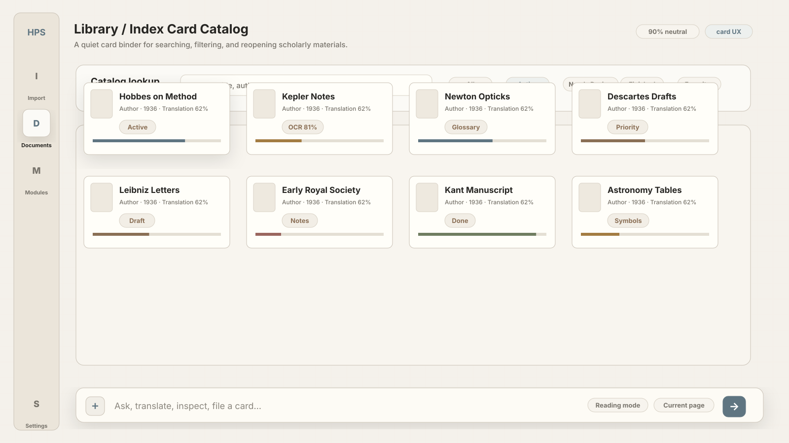

The document library works like a disciplined card catalog with search, filters, and subtle state marks.

### 4. Reading / Active Page Card

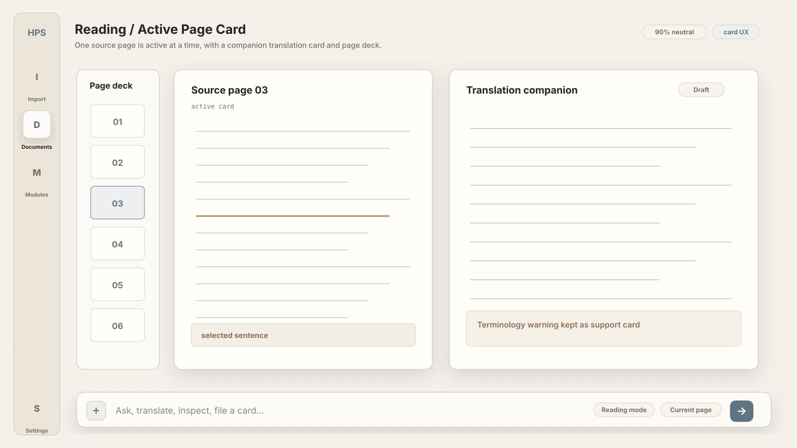

The reader keeps one source page active at a time. The translation is a companion card, not a cramped table column.

### 5. Composer / Current Hand

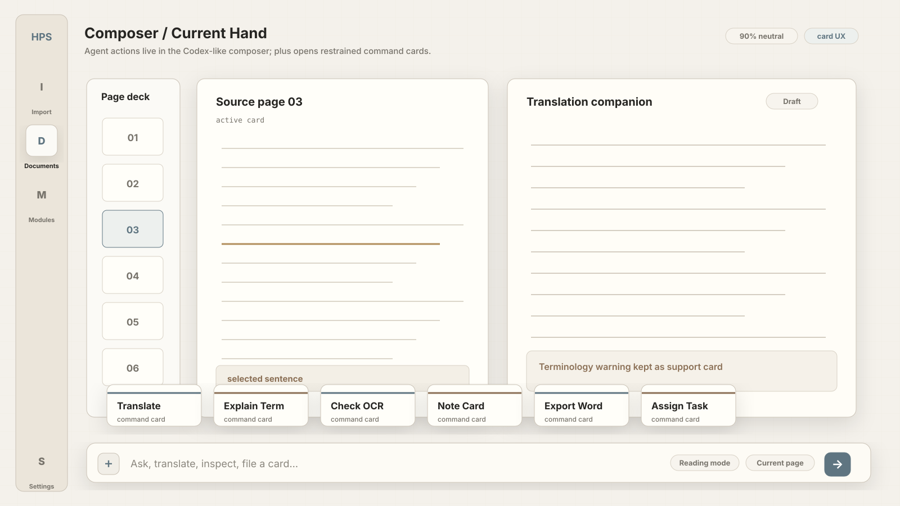

The Codex-like composer holds the Agent interaction. The plus menu opens a restrained hand of command cards.

### 6. Modules / Equip Function Cards

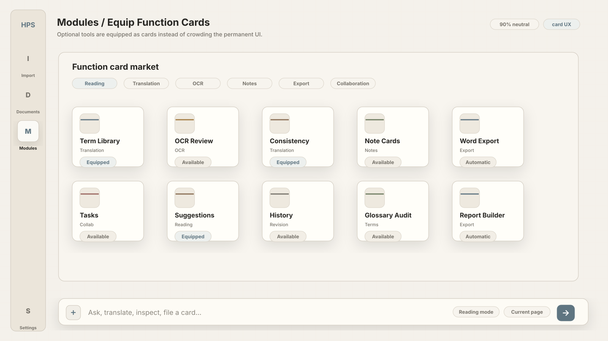

The module market presents optional capabilities as equipable function cards, grouped by workflow.

### 7. Active Modules / Floating Card

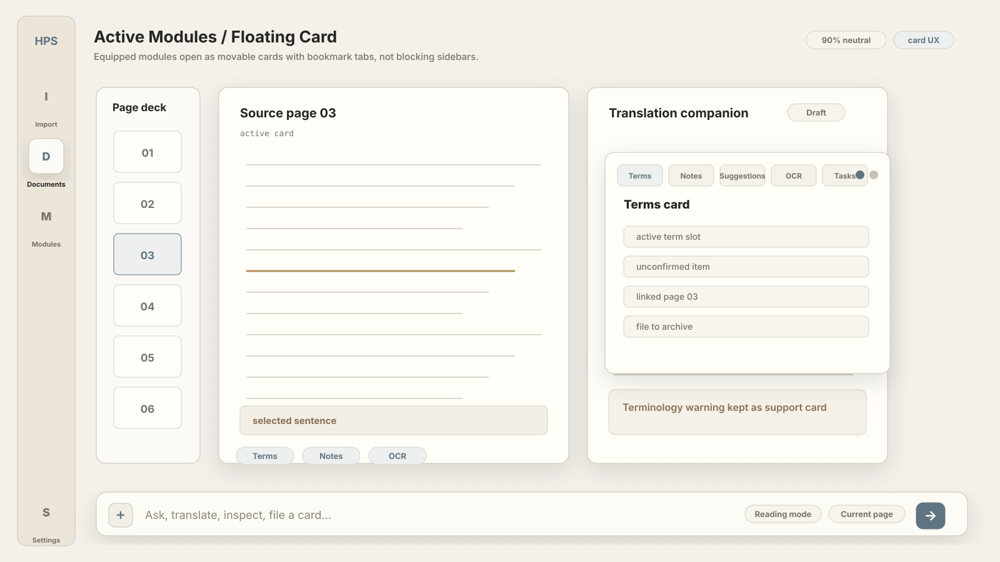

Equipped modules open as movable floating cards with bookmark tabs. They should not become full blocking sidebars.

### 8. OCR / Inspect And Repair Card

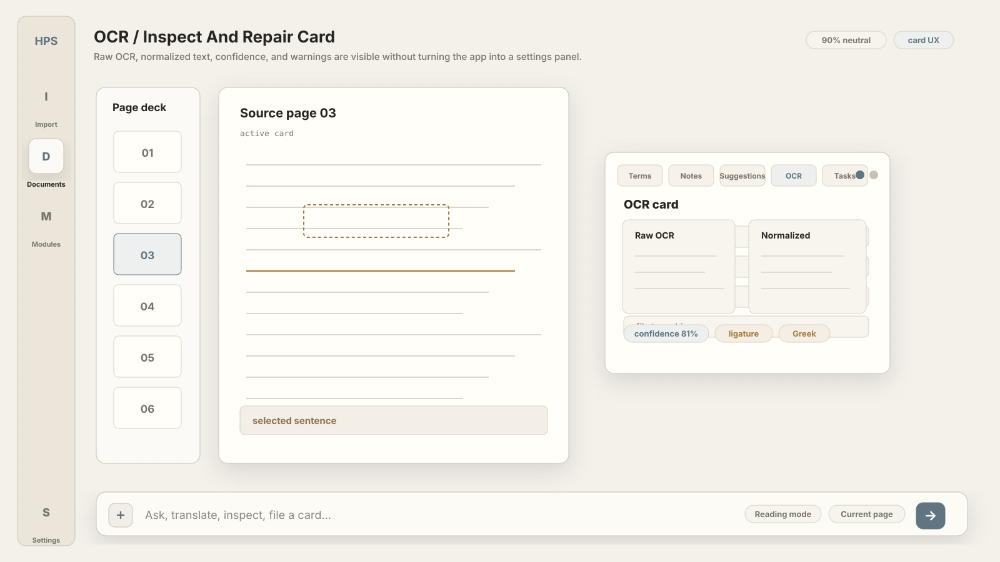

OCR review shows raw OCR, normalized text, confidence, and warnings as an inspection card.

### 9. Translation / Revision Stack

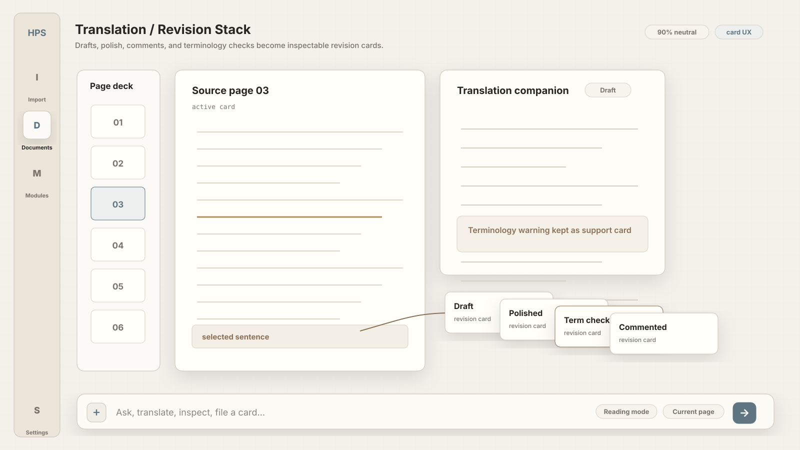

Translation review appears as a stack of draft, polish, terminology, and comment cards.

### 10. Glossary / Term Deck

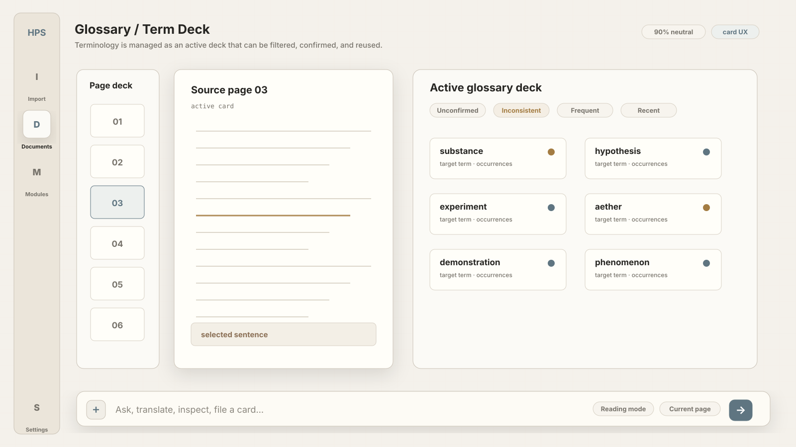

The glossary is an active terminology deck that can be filtered, confirmed, and reused.

### 11. Notes / File Thought Cards

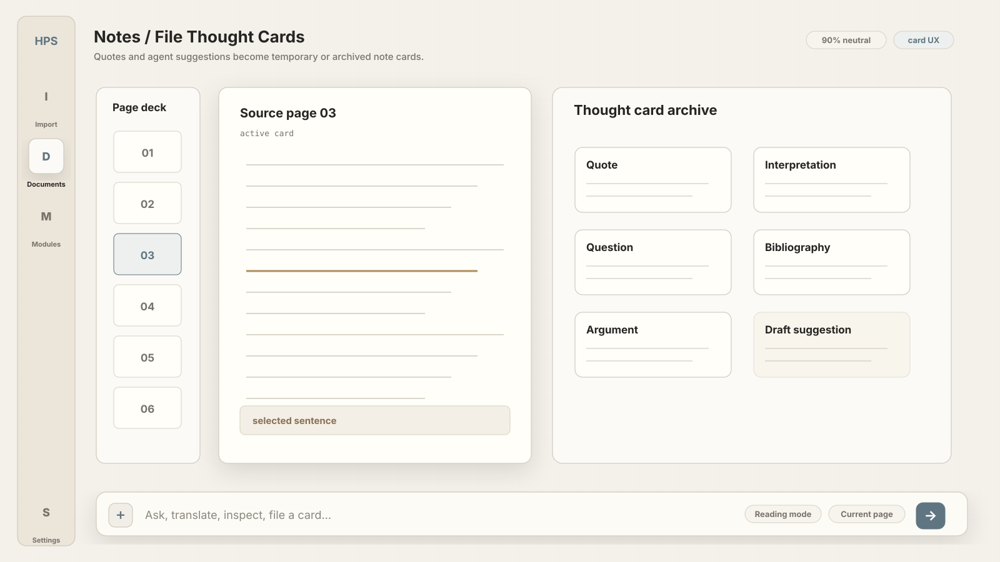

Selected text and Agent suggestions become temporary or archived thought cards.

### 12. Export / Assemble Word Bundle

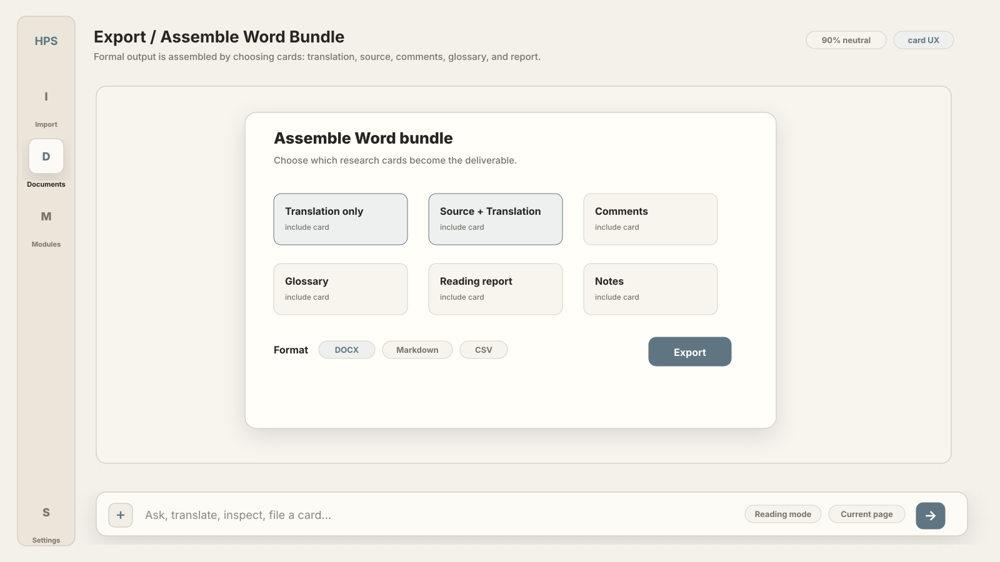

DOCX export is framed as assembling selected research cards into a formal output bundle.

### 13. Collaboration / Assignment Cards

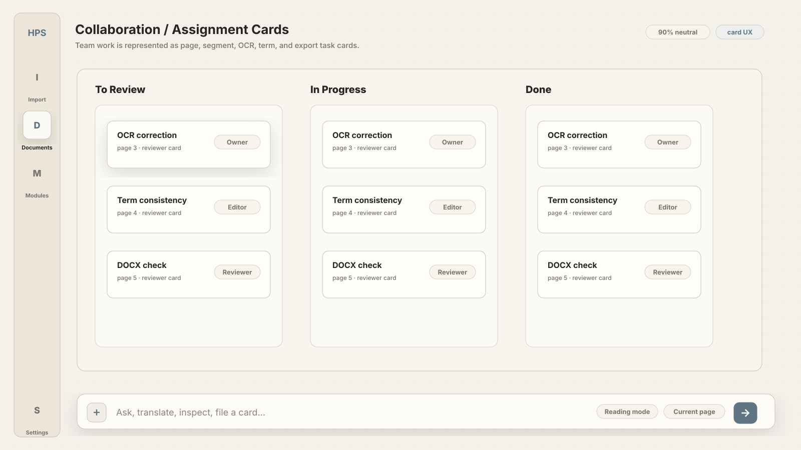

Collaboration starts as task and responsibility cards, not real-time cursor complexity.

### 14. History / Save Slot Stack

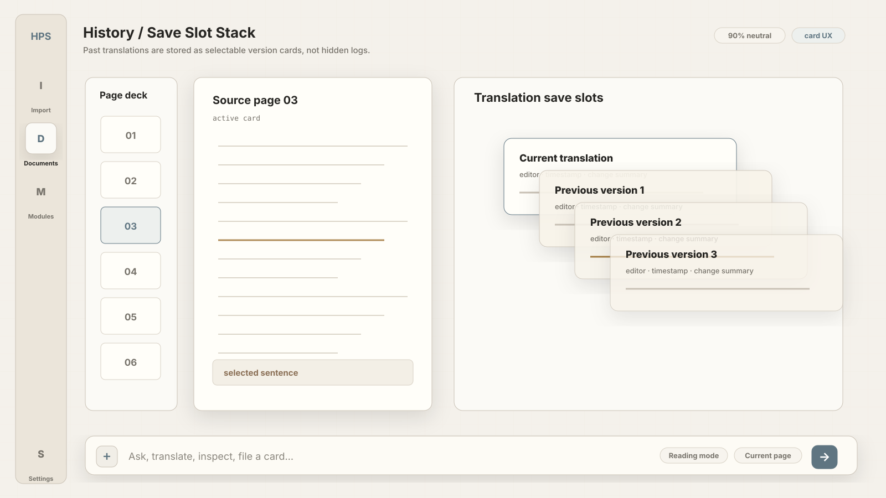

Revision history uses save-slot-like card stacks so older translations remain inspectable.

### 15. Settings / Card Back Configuration

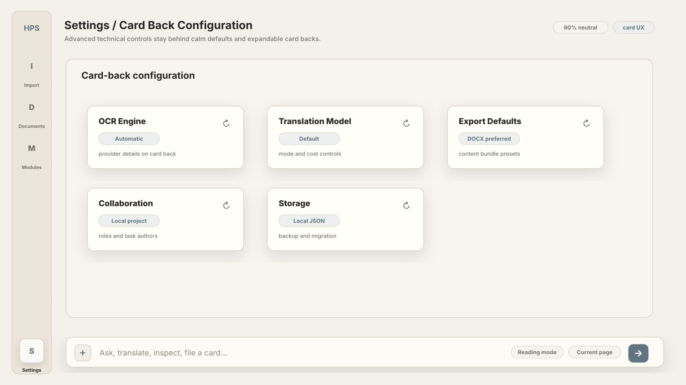

Advanced settings live behind calm defaults, like information on the back of a card.

## Implementation Notes

These concept images are deterministic SVG files generated by:

```powershell
node docs\design\card-concept-ui\generate-concepts.mjs
```

The SVGs are intentionally low-color and structural. They are not final production UI; they define the interaction vocabulary for the next front-end pass.

## Front-End Translation

Use these concepts to guide front-end work in this order:

1. Keep the reading surface stable: page deck, active source card, companion translation card, composer.
2. Move Agent actions into the composer and plus menu as command cards.
3. Keep modules optional and equipable.
4. Render active modules as movable floating cards with bookmark tabs.
5. Treat DOCX export, OCR review, notes, glossary, tasks, and revisions as card flows.
6. Keep color sparse so long work sessions remain focused.
